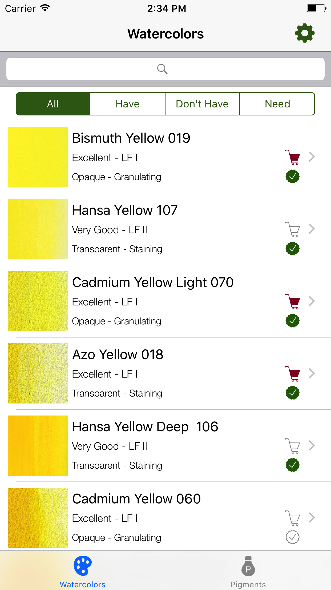

# Watercolor

iOS app used to keep inventory of M Graham watercolor paints (http://mgraham.com/products/watercolors/)
The app has all M Graham watercolor paints and pigments stored in core data.  Users can log into Facebook with
OAuth which will automatically log into Firebase and create a new user.  User's paint inventory and wishlist data
will be store both in core data and in backed up in Firebase.

This app also serves as an excellent reference for each paint and pigment.



## Getting Started

Install the app on an iOS device

### Prerequisites

An iOS device capable of running Version 8.3.3 (8E3004b) 
```
An iOS device capable of running Version 8.3.3 (8E3004b) 
Developed with Swift 3.1
```
## Built With

* XCode Version 8.3.3 (8E3004b) 
* Developed with Swift 3.1

## Authors

* **Paul ReFalo**

## Acknowledgements

* Many thanks to everyone at Udacity for the terrific program

## License

This project open; no licensing


